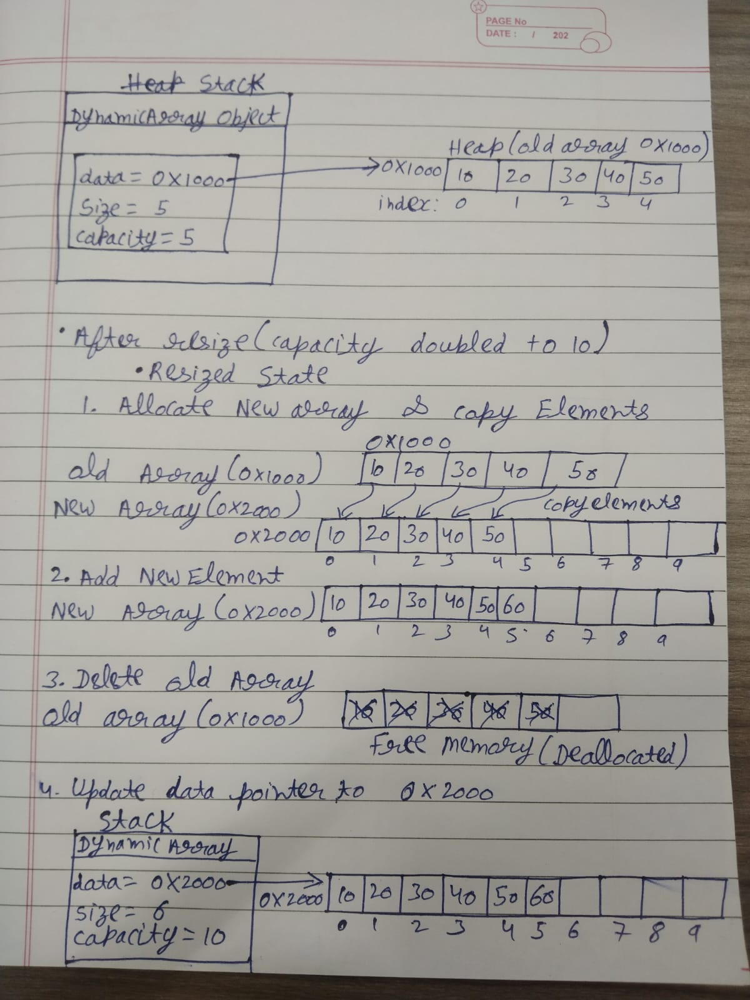

# Design Proposal of Dynamic Array

---

# Section 1 — Public API

The public API includes all methods that users can call. The APIs are designed to provide the most important operations.

## DynamicArray:
A Dynamic Array is a contiguous memory data structure that automatically grows when its capacity becomes full. Unlike a fixed-size array, a dynamic array can resize itself during runtime, allowing flexible storage of elements while still providing O(1) index-based access.

### Methods

```cpp
template <typename T>
class DynamicArray {
private:
    T* data_;        // Pointer to the dynamically allocated array
    int size_;       // Number of elements currently stored
    int capacity_;   // Total allocated capacity

    // Allocates a larger array and copies existing elements
    void resize(int newCapacity);

public:
    // Creates an empty DynamicArray with an initial capacity
    DynamicArray();

    // Rule of Three

    // Releases dynamically allocated memory
    ~DynamicArray();

    // Creates a deep copy of another DynamicArray
    DynamicArray(const DynamicArray& other);

    // Replaces current contents with a deep copy of another DynamicArray
    DynamicArray& operator=(const DynamicArray& other);

    // Element Operations

    // Adds an element to the end of the array
    void append(T value);

    // Inserts an element at the specified index
    void insert(int index, T value);

    // Removes the element at the specified index
    void remove(int index);

    // Returns the element at the specified index
    T get(int index) const;

    // Updates the value at the specified index
    void set(int index, T value);

    // Capacity / Size

    // Returns the number of stored elements
    int size() const;

    // Returns the current storage capacity
    int capacity() const;

    // Returns true if the array contains no elements
    bool empty() const;

    // Utility

    // Removes all elements from the array
    // (capacity remains unchanged)
    void clear();
};
```

### Why this API?

The DynamicArray API includes methods for adding, removing, and accessing elements. The `get()` and `set()` methods make it easy to read and modify values while keeping the array data private. The `size()` and `capacity()` methods allow users to see how many elements are stored and how much memory is available. Copy constructor and assignment operator are included to support deep copying.

---

# Section 2 — Internal Representation

## Dynamic Array

<p align="center"> 

</p>

## Memory Management:

The destructor will use delete[] to free the dynamically allocated array.

The copy constructor and assignment operator will perform deep copying.
A deep copy creates a new array and copies all elements into it.

A shallow copy only copies the pointer address, causing two objects to share
the same memory. This can lead to data changes affecting both objects and
double deletion errors.

The Rule of Three is implemented:
- Destructor
- Copy Constructor
- Copy Assignment Operator

---

# Section 3 — Complexity Estimates

## DynamicArray

| Operation              | Best Case | Average Case   | Worst Case | Reason                                                                                                                 |
| ---------------------- | --------- | -------------- | ---------- | ---------------------------------------------------------------------------------------------------------------------- |
| `get(index)`           | O(1)      | O(1)           | O(1)       | Direct access using the index; no traversal required.                                                                  |
| `set(index, value)`    | O(1)      | O(1)           | O(1)       | Value is written directly to the memory location corresponding to the index.                                           |
| `append(value)`        | O(1)      | O(1) amortized | O(n)       | Adding at the end is constant time if space exists. Resizing requires allocating a new array and copying all elements. |
| `insert(index, value)` | O(1)      | O(n)           | O(n)       | Inserting at the end without resizing is constant time. Otherwise, elements must be shifted.                           |
| `remove(index)`        | O(1)      | O(n)           | O(n)       | Removing the last element requires no shifting. Removing elsewhere requires shifting elements.                         |
| `size()`               | O(1)      | O(1)           | O(1)       | Returns a stored size value.                                                                                           |
| `capacity()`           | O(1)      | O(1)           | O(1)       | Returns a stored capacity value.                                                                                       |
| `empty()`              | O(1)      | O(1)           | O(1)       | Checks whether the stored size is zero.                                                                                |
| `clear()`              | O(1)      | O(1)           | O(1)       | Resets the size counter without removing elements individually.                                                        |


## Why append() is Amortized O(1)

The append operation usually inserts directly at the end of the array.

Example:

```text
[10][20][30][ ][ ]
```
Appending:
```text
append(40)
```
requires only:
1. Store the value
2. Increment size

Cost:

```text
O(1)
```

---

### When Resizing Occurs

Suppose:

```text
Capacity = 5
Size = 5
```

Appending another element requires:

1. Allocate larger memory
2. Copy existing elements
3. Delete old memory
4. Update pointer

Cost:

```text
O(n)
```

because n elements are copied.

---

### Mathematical Proof

Assume the capacity doubles whenever the array becomes full.

Resizing sequence:

```text
5 → 10 → 20 → 40 → 80 → ...
```

Copy operations performed:

```text
5 + 10 + 20 + 40 + ...
```

This is a geometric series.

For n inserted elements:

```text
5 + 10 + 20 + ... < 2n
```

Therefore total copying work is bounded by:

```text
O(n)
```

for n insertions.

The normal insertions themselves cost:

```text
O(n)
```

Total work:

```text
O(n) + O(n)
=
O(n)
```

Average cost per insertion:

```text
O(n) / n
=
O(1)
```

Therefore:

```text
append() = O(1) amortized
```

Although a single insertion may trigger an O(n) resize, the average cost across a long sequence of insertions remains constant.

---


# Section 4 — Design Evolution and Challenges

This project was developed iteratively. The final design was not chosen immediately; several alternatives were considered and refined during implementation.

## Fixed-Size Array

### Initial Idea

The first design used a fixed-size array.

```cpp
T* data;
int size;
const int capacity = 100;
```

### Problem

A fixed-size array cannot grow when additional elements are inserted.

Example:

```text
Capacity = 5
Size = 5

append(6)
```

The insertion fails because no additional memory is available.

### Conclusion

Rejected because it limits scalability and makes the container unsuitable for general-purpose use.

---

## Dynamic Array with Incremental Growth

### Initial Idea

Increase capacity by one whenever the array becomes full.

```text
Capacity = Capacity + 1
```

Example:

```text
1 → 2 → 3 → 4 → 5 → ...
```

### Problem

Each insertion after reaching capacity requires:
  
1. Allocating a new array
2. Copying all existing elements
3. Deleting the old array

For n insertions:

```text
1 + 2 + 3 + ... + n
```

Total work:

```text
n(n+1)/2
```

Complexity:

```text
O(n²)
```

This approach becomes extremely inefficient for large datasets.

### Conclusion

Rejected because frequent reallocations produce poor performance.

---

## Dynamic Array with Doubling Strategy

### Final Design

When the array becomes full:

```text
newCapacity = capacity × 2
```

Example:

```text
5 → 10 → 20 → 40 → 80
```

### Benefits

* Fewer reallocations
* Better insertion performance
* Amortized O(1) append operation
* Industry-standard strategy used by many dynamic array implementations

---