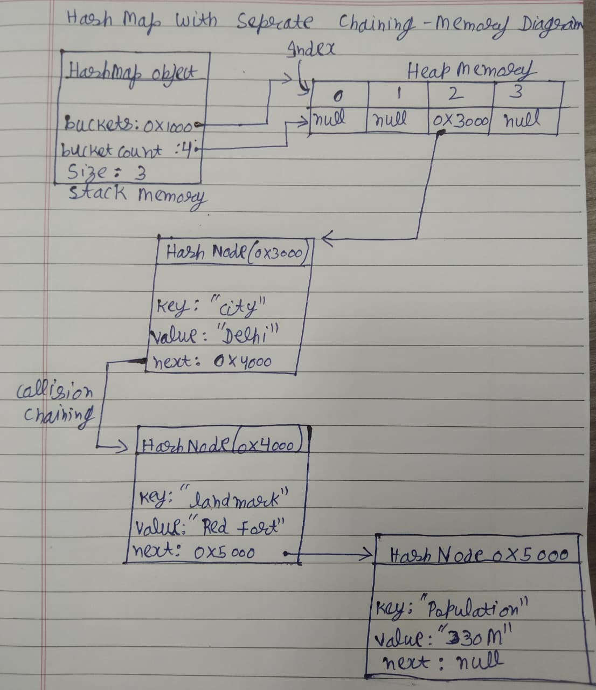

# Design Proposal of HashMAp


# Section 1 — Public API

The public API includes all methods that users can call. The APIs are designed to provide the most important operations.


## HashMap:
A Hash Map is a key-value data structure that uses a hash function to map keys to storage locations called buckets. It provides O(1) average-time insertion, lookup, and deletion operations.

### Methods

```cpp
template <typename K, typename V>
class HashMap {
private:
    struct Entry {
        K key;
        V value;
        Entry* next;

        Entry(const K& k, const V& v)
            : key(k), value(v), next(nullptr) {}
    };

    Entry** buckets_;
    int size_;
    int capacity_;

    int hash(const K& key) const;
    void resize(int newCapacity);

public:
    // Constructors
    HashMap();
   

    // Rule of Three
    ~HashMap();
    HashMap(const HashMap& other);
    HashMap& operator=(const HashMap& other);

    // Insert / Update
    void set(const K& key,
             const V& value);

    // Lookup
    V get(const K& key) const;
    bool exists(const K& key) const;

    // Removal
    void remove(const K& key);

    // Information
    int size() const;
    double loadFactor() const;

    // Utility
    void clear();
};
```

### Why this API?

The HashMap API stores data as key-value pairs. The `set()` method is used for both inserting new data and updating existing data. The `get()` method retrieves a value using its key. The `exists()` method checks whether a key is present. The `loadFactor()` method is included because it helps show when the table should be resized. Hashing and collision handling are kept private because users do not need to interact with those details directly.

---


# Section 2 — Internal Representation

## Hash Map:

<p align="center"> 

</p>

## Memory Management:

The HashMap destructor will first go through every bucket and delete all HashNodes
inside each chain. After deleting all nodes, it will delete the bucket array.

The copy constructor and assignment operator will use deep copying. A new bucket
array and new HashNodes will be created, and all key-value pairs will be copied.

A shallow copy would only copy the bucket pointer, causing two HashMaps to share
the same nodes. This can cause data corruption and double deletion when objects
are destroyed.

The Rule of Three will be implemented:
- Destructor
- Copy Constructor
- Copy Assignment Operator

---

# Section 3 — Complexity Estimates


## HashMap

| Operation         | Best Case | Average Case | Worst Case | Reason                                                                                                                                                                                 |
| ----------------- | --------- | ------------ | ---------- | -------------------------------------------------------------------------------------------------------------------------------------------------------------------------------------- |
| `set(key, value)` | O(1)      | O(1)         | O(n)       | A good hash function distributes keys evenly among buckets, allowing quick insertion. In the worst case, all keys collide into the same bucket and a full chain traversal is required. |
| `get(key)`        | O(1)      | O(1)         | O(n)       | The hash function directly identifies the bucket. If many collisions occur, the entire chain may need to be searched.                                                                  |
| `exists(key)`     | O(1)      | O(1)         | O(n)       | Searches the bucket chain for the key. Performance depends on the number of collisions.                                                                                                |
| `remove(key)`     | O(1)      | O(1)         | O(n)       | Removing a key is fast when it is near the beginning of a bucket chain. In the worst case, the entire chain must be searched.                                                          |
| `size()`          | O(1)      | O(1)         | O(1)       | Returns a stored count of key-value pairs.                                                                                                                                             |
| `loadFactor()`    | O(1)      | O(1)         | O(1)       | Calculated using stored size and bucket count variables.                                                                                                                               |
| `clear()`         | O(n)      | O(n)         | O(n)       | Every node in every bucket must be deleted.                                                                                                                                            |
| `rehash()`        | O(n)      | O(n)         | O(n)       | All existing key-value pairs must be moved into a new bucket array and reinserted using the new hash table size.                                                                       |

---

# Section 4 — Design Evolution and Challenges

This project was developed iteratively. The final HashMap design was not selected immediately; several collision-handling strategies and resizing approaches were considered before choosing the final implementation.

## Fixed-Size Hash Table

### Initial Idea

The first design used a fixed-size hash table.

```cpp
Entry** buckets_;
const int capacity_ = 4;
```

### Problem

As more key-value pairs are inserted, the number of collisions increases.

Example:

```text
Bucket 0 → A → B → C → D
Bucket 1 → E
Bucket 2 → F
Bucket 3 → G
```

As the table becomes crowded, search and insertion operations become slower because longer chains must be traversed.

### Conclusion

Rejected because performance degrades significantly as the number of stored elements grows.

---

## Hash Map Without Rehashing

### Alternative Design

The next design considered allowed collisions but never resized the table.

Example:

```text
Bucket Count = 4
```

All new elements would continue to be inserted into the existing buckets.

### Problem

As more elements are inserted, the load factor continues to increase.

```text
Load Factor = Size / Bucket Count
```

A high load factor creates long chains and increases lookup time.

Example:

```text
Bucket 0 → A → B → C → D → E → F
```

Searching may require traversing many nodes.

### Conclusion

Rejected because performance becomes increasingly poor as the data set grows.

---

## Open Addressing

### Alternative Design

I considered using open addressing to resolve collisions.

Instead of storing multiple entries in a linked list, collisions are resolved by searching for another available bucket.

Example:

```text
Index 2 occupied
↓
Probe Index 3
↓
Probe Index 4
```

### Benefits

* No extra linked-list nodes
* Better cache locality
* Lower memory overhead

### Problem

Insertion, deletion, and searching become more complicated.

Deleted entries require special marker values, and performance decreases when the table becomes crowded.

### Conclusion

Rejected because it increases implementation complexity and requires additional probing logic.

---

## Hash Map with Separate Chaining

### Final Design

The final implementation uses separate chaining.

Each bucket stores a linked list of entries.

```text
Bucket 0 → A → D → H
Bucket 1 → B → E
Bucket 2 → C
Bucket 3 → F → G
```

When multiple keys map to the same bucket, they are stored in the same chain.

### Benefits

* Simple collision handling
* Easy insertion and deletion
* Good average-case performance
* No probing logic required
* Handles high collision rates gracefully

---

## Rehashing Strategy

To maintain efficient performance, the HashMap monitors its load factor.

```text
Load Factor = Size / Capacity
```

The chosen threshold is:

```text
0.75
```

When:

```text
Load Factor > 0.75
```

the bucket count is doubled.

Example:

```text
4 → 8 → 16 → 32
```

All existing entries are then rehashed into the new bucket array.

### Benefits

* Keeps chains short
* Maintains O(1) average-case operations
* Reduces collision frequency

---

## Hash Function Design

The hash function uses a polynomial rolling approach:

```text
hash = hash * 53 + character
```

The final bucket index is computed as:

```text
index = hash(key) % bucketCount
```

### Why This Hash Function?

A simple character-sum hash:

```text
hash = c1 + c2 + c3 + ...
```

causes many collisions because different strings can produce identical sums.

Example:

```text
"abc"
"cab"
```

Both produce the same total.

The polynomial rolling approach considers both character values and their positions, producing a more uniform distribution across buckets.

### Conclusion

Chosen because it significantly reduces collisions compared to simpler hashing methods while remaining easy to implement.

---

## Memory Management Decisions

The HashMap allocates memory dynamically for both the bucket array and the linked-list nodes stored inside each bucket.

The implementation follows the Rule of Three:

* Destructor
* Copy Constructor
* Copy Assignment Operator

### Deep Copy Decision

The copy constructor and assignment operator perform deep copying.

When copying a HashMap:

```text
HashMap A
Bucket 0 → A
Bucket 1 → B
```

a completely new bucket array and new nodes are created:

```text
HashMap B
Bucket 0 → A
Bucket 1 → B
```

The two objects do not share memory.

### Why Not Shallow Copy?

A shallow copy would copy only the bucket pointer:

```text
HashMap A ──► Bucket Array
HashMap B ──► Same Bucket Array
```

This would lead to:

* Shared ownership
* Accidental modification
* Dangling pointers
* Double deletion during destruction

### Conclusion

Deep copying was chosen because it provides safe ownership and independent storage for every HashMap object.

## Bucket Storage Design

The bucket array is stored in **contiguous memory**.

```cpp
Entry** buckets_;
```

Memory layout:

```text
buckets_

+-----+-----+-----+-----+
|  *  |  *  |  *  |  *  |
+-----+-----+-----+-----+
   0     1     2     3
```

Each bucket stores a pointer to the first node in its collision chain.

Example:

```text
Bucket 0 → [A] → [D] → [H]

Bucket 1 → [B] → [E]

Bucket 2 → [C]

Bucket 3 → nullptr
```

### Why Store Buckets Contiguously?

I chose contiguous storage for the bucket array because:

* Direct indexing is possible using:

```cpp
index = hash(key) % capacity_;
```

* Accessing a bucket requires only:

```cpp
buckets_[index]
```

which is an O(1) operation.

* Contiguous memory improves cache locality because nearby bucket pointers are stored close together in memory.

* Resizing becomes simpler because a new bucket array can be allocated and all entries can be rehashed into it.

### Why Not Store Buckets Randomly?

An alternative design would allocate each bucket independently.

Example:

```text
Bucket 0 → Address 0x1000

Bucket 1 → Address 0xA420

Bucket 2 → Address 0x5F30

Bucket 3 → Address 0xC810
```

This approach introduces several problems:

* Additional memory allocations are required.
* Poor cache performance due to scattered memory locations.
* More complicated memory management.
* No advantage for bucket lookup because hashing already provides O(1) indexing.

### Why Are Collision Chains Not Contiguous?

While the bucket array itself is contiguous, the linked-list nodes inside each bucket are allocated separately.

Example:

```text
Bucket 0
   ↓
[A] → [D] → [H]
```

These nodes may exist at completely different memory addresses.

This is expected because separate chaining uses linked lists to store colliding entries.

### Conclusion

The bucket array is stored contiguously because it provides fast O(1) indexing, better cache efficiency, and simpler resizing. Only the collision-chain nodes are stored in separate memory locations.
