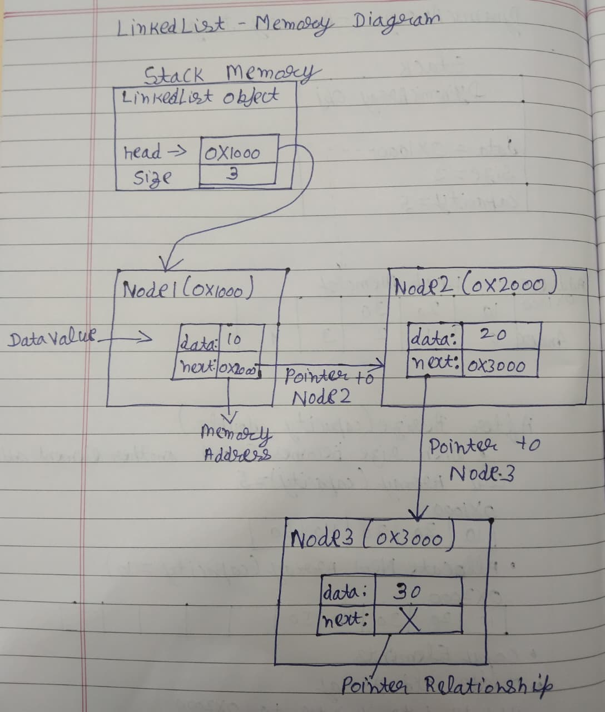

# Design Proposal of Linked list 


# Section 1 — Public API

The public API includes all methods that users can call. The APIs are designed to provide the most important operations.

## LinkedList:
A Linked List is a linear data structure consisting of nodes connected through pointers. Each node stores data and links to neighboring nodes. In a Doubly Linked List, every node contains both a next pointer and a previous pointer, allowing traversal in both directions.

### Methods

```cpp
template <typename T>
class LinkedList {
private:
    struct Node {
        T data;
        Node* prev;
        Node* next;

        Node(T value)
            : data(value),
              prev(nullptr),
              next(nullptr) {}
    };

    Node* head_;
    Node* tail_;
    int size_;

public:
    // Constructors
    LinkedList();

    // Rule of Three
    ~LinkedList();
    LinkedList(const LinkedList& other);
    LinkedList& operator=(const LinkedList& other);

    // Insertion
    void insertFront(T value);
    void insertBack(T value);
    void insert(int index, T value);

    // Deletion
    void deleteFront();
    void deleteBack();
    void remove(int index);

    // Search
    bool search(T value) const;

    // Capacity
    int size() const;
    bool empty() const;

    // Utility
    void clear();
};
```


### Why this API?

The LinkedList API is implemented as a doubly linked list. Each node stores pointers to both the next and previous nodes, allowing traversal in both directions. This makes insertion and deletion operations easier because neighboring nodes can be accessed directly without always traversing from the head.

---


# Section 2 — Internal Representation

## Linked List

<p align="center"> 

</p>

## Memory Management: 
The destructor will start from the head node and delete each node one by one until the end of the list is reached.

The copy constructor and copy assignment operator will perform deep copying. New nodes will be allocated for the copied list, ensuring that two LinkedList objects never share the same memory.

A shallow copy would only copy the head and tail pointers, causing multiple lists to point to the same nodes. This could lead to accidental data modification, dangling pointers, and double deletion errors when destructors are executed.

The Rule of Three will be implemented:

Destructor
Copy Constructor
Copy Assignment Operator

---


# Section 3 — Complexity Estimates


## LinkedList

| Operation              | Best Case | Average Case | Worst Case | Reason                                                                                                       |
| ---------------------- | --------- | ------------ | ---------- | ------------------------------------------------------------------------------------------------------------ |
| `insertFront(value)`   | O(1)      | O(1)         | O(1)       | A new node is added at the beginning and the head pointer is updated.                                        |
| `insert(index, value)` | O(1)      | O(n)         | O(n)       | Inserting at the front is constant time. Otherwise, the list must be traversed to find the correct position. |
| `deleteFront()`        | O(1)      | O(1)         | O(1)       | The head pointer is moved to the next node and the old node is deleted.                                      |
| `remove(index)`        | O(1)      | O(n)         | O(n)       | Removing the first node is constant time. Removing elsewhere requires traversal.                             |
| `search(value)`        | O(1)      | O(n)         | O(n)       | The value may be found in the first node, but in the worst case every node must be checked.                  |
| `size()`               | O(1)      | O(1)         | O(1)       | Returns a stored size counter.                                                                               |
| `empty()`              | O(1)      | O(1)         | O(1)       | Checks whether the list size is zero or the head is `nullptr`.                                               |
| `clear()`              | O(n)      | O(n)         | O(n)       | Every node must be visited and deleted.                                                                      |
---

# Section 4 — Design Evolution and Challenges

This project was developed iteratively. The final design was not selected immediately; multiple linked list variations were considered before choosing the final implementation.

## Singly Linked List

### Initial Idea

The first design considered was a singly linked list.

```cpp
struct Node
{
    T data;
    Node* next;
};
```

Each node stores data and a pointer to the next node.

Example:

```text
[10] → [20] → [30] → nullptr
```

### Benefits

* Simple implementation
* Less memory per node
* Efficient insertion at the front

### Problem

A singly linked list only supports forward traversal.

Operations such as deleting a node or traversing backward require additional work because there is no pointer to the previous node.

Example:

```text
[10] → [20] → [30]
```

To remove `30`, the node containing `20` must first be located.

### Conclusion

Rejected because backward traversal and efficient deletion were important requirements.

---

## Doubly Linked List Without Tail Pointer

### Alternative Design

The next design considered was a doubly linked list containing only a head pointer.

```cpp
Node* head_;
```

Each node stores:

```cpp
struct Node
{
    T data;
    Node* prev;
    Node* next;
};
```

### Benefits

* Supports forward traversal
* Supports backward traversal
* Easier node deletion

### Problem

Appending an element requires traversing the entire list to find the last node.

Example:

```text
Head
 ↓
[10] ⇄ [20] ⇄ [30]
```

To insert at the end:

1. Start at head
2. Traverse to the last node
3. Insert new node

Complexity:

```text
O(n)
```

### Conclusion

Rejected because appending at the end would become inefficient for large lists.

---

## Doubly Linked List With Head and Tail Pointers

### Final Design

The final implementation uses:

```cpp
Node* head_;
Node* tail_;
int size_;
```

Each node stores:

```cpp
struct Node
{
    T data;
    Node* prev;
    Node* next;
};
```

Example:

```text
Head                         Tail
 ↓                            ↓
[10] ⇄ [20] ⇄ [30] ⇄ [40]
```

### Benefits

* Forward traversal
* Backward traversal
* O(1) insertion at front
* O(1) insertion at back
* O(1) deletion at front
* O(1) deletion at back
* Direct access to both ends of the list

Because both head and tail are maintained, operations at either end do not require traversal.

---

## Memory Management Decisions

The LinkedList allocates memory dynamically for each node and therefore requires explicit resource management.

The implementation follows the Rule of Three:

* Destructor
* Copy Constructor
* Copy Assignment Operator

### Deep Copy Decision

The copy constructor and assignment operator perform deep copying.

When copying a list:

```text
List A
[10] ⇄ [20] ⇄ [30]
```

A completely new set of nodes is created:

```text
List B
[10] ⇄ [20] ⇄ [30]
```

The two lists do not share memory.

### Why Not Shallow Copy?

A shallow copy would copy only the head and tail pointers:

```text
List A ──► Nodes
List B ──► Same Nodes
```

This creates several problems:

* Shared ownership
* Accidental modification of data
* Dangling pointers
* Double deletion during destruction

### Conclusion

Deep copying was chosen because it provides independent ownership and safe memory management.

---

## Why Linked List Instead of Dynamic Array?

A DynamicArray was considered as an alternative.

Dynamic arrays store elements in contiguous memory:

```text
[10][20][30][40]
```

Insertion in the middle requires shifting elements:

```text
O(n)
```

A LinkedList stores elements as separate nodes:

```text
[10] ⇄ [20] ⇄ [30] ⇄ [40]
```

Once a node is located, insertion or deletion only requires updating pointers.

Advantages:

* Efficient insertions
* Efficient deletions
* No resizing required
* Dynamic memory growth

For workloads involving frequent insertions and removals, a LinkedList provides greater flexibility than a DynamicArray.

---

## Memory Management Decisions

All three data structures allocate memory dynamically, so I will implement the Rule of Three: destructor, copy constructor, and copy assignment operator.

I chose deep copying instead of shallow copying. Deep copying creates independent copies of the data, preventing shared ownership problems, accidental modifications, and double deletion errors. Although deep copying requires additional memory and copying time, it is safer and more appropriate for these data structures.
